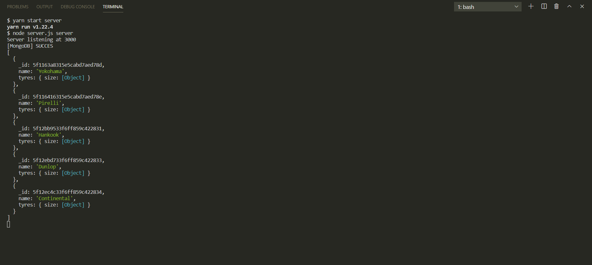
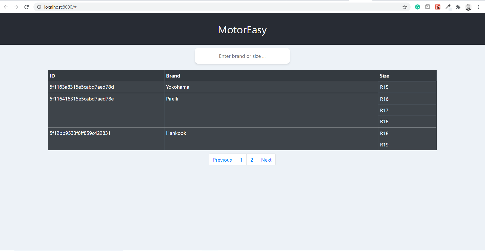

## clone the project

## from the server directory open visual studio code 

## yarn install

## yarn start server 

The server will start to run

## from the client directory open visual studio code

## yarn install

## yarn start

